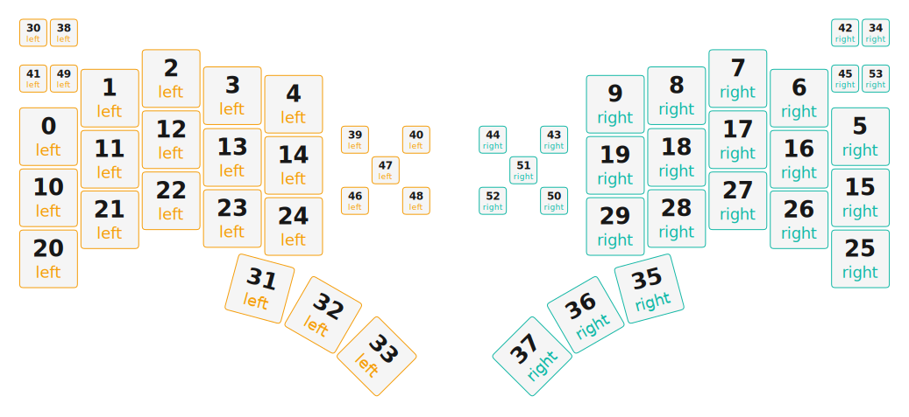

# ZMK Configuration for Studio36KB

*Generated by Shield Wizard for ZMK*



Download compiled firmware from the Actions tab. <https://zmk.dev/docs/user-setup#installing-the-firmware>

Edit your keymap <https://zmk.dev/docs/keymaps>.
User keymap is located at [`config/studio36kb.keymap`](config/studio36kb.keymap).

-----

<details>
<summary>
Shield Wizard Debug Information
</summary>

In case of broken configuration, here is the Shield Wizard internal data used to generate this configuration:

Commit: 5840d41ac0915092c8fe45da617ffb4bb91e1b97

```json
{"name":"Studio36KB","shield":"studio36kb","dongle":false,"modules":[],"layout":[{"id":"01KNJ6GSCMSKV66ZX7H393W5YD","part":0,"row":0,"col":5,"w":1,"h":1,"x":5.75,"y":1.7,"r":0,"rx":0,"ry":0},{"id":"01KNJ6GSCMJ9G8XP45HB935F1C","part":0,"row":0,"col":6,"w":1,"h":1,"x":6.75,"y":1.07,"r":0,"rx":0,"ry":0},{"id":"01KNJ6GSCME7STYW7E0SRDAFQ0","part":0,"row":0,"col":7,"w":1,"h":1,"x":7.75,"y":0.75,"r":0,"rx":0,"ry":0},{"id":"01KNJ6GSCMYETS266B0GEG6CY7","part":0,"row":0,"col":8,"w":1,"h":1,"x":8.75,"y":1.03,"r":0,"rx":0,"ry":0},{"id":"01KNJ6GSCMM85SV87BS18Z7717","part":0,"row":0,"col":9,"w":1,"h":1,"x":9.75,"y":1.17,"r":0,"rx":0,"ry":0},{"id":"01KNJ6GSCMFK53C5WC97AKYF11","part":1,"row":0,"col":10,"w":1,"h":1,"x":19,"y":1.7,"r":0,"rx":0,"ry":0},{"id":"01KNJ6GSCM6SY435BYW5VBBY6N","part":1,"row":0,"col":11,"w":1,"h":1,"x":18,"y":1.07,"r":0,"rx":0,"ry":0},{"id":"01KNJ6GSCMS3DMF6FDFA3NRWBN","part":1,"row":0,"col":12,"w":1,"h":1,"x":17,"y":0.75,"r":0,"rx":0,"ry":0},{"id":"01KNJ6GSCM72SYEWE6TZCYRQDG","part":1,"row":0,"col":13,"w":1,"h":1,"x":16,"y":1.03,"r":0,"rx":0,"ry":0},{"id":"01KNJ6GSCMPT0RJ5D6S7GS4JWE","part":1,"row":0,"col":14,"w":1,"h":1,"x":15,"y":1.17,"r":0,"rx":0,"ry":0},{"id":"01KNJ6GSCMR74MAGZFVMB4KGFC","part":0,"row":1,"col":5,"w":1,"h":1,"x":5.75,"y":2.7,"r":0,"rx":0,"ry":0},{"id":"01KNJ6GSCM6M835Z098ZWPJ2KC","part":0,"row":1,"col":6,"w":1,"h":1,"x":6.75,"y":2.07,"r":0,"rx":0,"ry":0},{"id":"01KNJ6GSCMZ6SQGSTRYR16300W","part":0,"row":1,"col":7,"w":1,"h":1,"x":7.75,"y":1.75,"r":0,"rx":0,"ry":0},{"id":"01KNJ6GSCMNFHV2XT9Y8VDJVED","part":0,"row":1,"col":8,"w":1,"h":1,"x":8.75,"y":2.04,"r":0,"rx":0,"ry":0},{"id":"01KNJ6GSCM2TT592DSRF3EX27J","part":0,"row":1,"col":9,"w":1,"h":1,"x":9.75,"y":2.17,"r":0,"rx":0,"ry":0},{"id":"01KNJ6GSCM0EYNTZCMXAGJV36K","part":1,"row":1,"col":10,"w":1,"h":1,"x":19,"y":2.7,"r":0,"rx":0,"ry":0},{"id":"01KNJ6GSCMX8HZ29JQMYJWH8FD","part":1,"row":1,"col":11,"w":1,"h":1,"x":18,"y":2.07,"r":0,"rx":0,"ry":0},{"id":"01KNJ6GSCMHX5KQ9954K76J3GH","part":1,"row":1,"col":12,"w":1,"h":1,"x":17,"y":1.75,"r":0,"rx":0,"ry":0},{"id":"01KNJ6GSCM7HPGP1MN2X9JVBSY","part":1,"row":1,"col":13,"w":1,"h":1,"x":16,"y":2.04,"r":0,"rx":0,"ry":0},{"id":"01KNJ6GSCMG8KBD7N1V8YW8WC1","part":1,"row":1,"col":14,"w":1,"h":1,"x":15,"y":2.17,"r":0,"rx":0,"ry":0},{"id":"01KNJ6GSCMSA4X894KMCPVT3RM","part":0,"row":2,"col":5,"w":1,"h":1,"x":5.75,"y":3.7,"r":0,"rx":0,"ry":0},{"id":"01KNJ6GSCMXBW1MEHDVDXD4ZQA","part":0,"row":2,"col":6,"w":1,"h":1,"x":6.75,"y":3.06,"r":0,"rx":0,"ry":0},{"id":"01KNJ6GSCNQJTRQSE6Z9KXNHN2","part":0,"row":2,"col":7,"w":1,"h":1,"x":7.75,"y":2.75,"r":0,"rx":0,"ry":0},{"id":"01KNJ6GSCNJ5EJVZWSZF22VFEY","part":0,"row":2,"col":8,"w":1,"h":1,"x":8.75,"y":3.04,"r":0,"rx":0,"ry":0},{"id":"01KNJ6GSCN3KY1SRHH3VS0H475","part":0,"row":2,"col":9,"w":1,"h":1,"x":9.75,"y":3.17,"r":0,"rx":0,"ry":0},{"id":"01KNJ6GSCNX3041K8WK5Z6NS9Z","part":1,"row":2,"col":10,"w":1,"h":1,"x":19,"y":3.7,"r":0,"rx":0,"ry":0},{"id":"01KNJ6GSCN4H17YENNBNF8CYEY","part":1,"row":2,"col":11,"w":1,"h":1,"x":18,"y":3.06,"r":0,"rx":0,"ry":0},{"id":"01KNJ6GSCNWK4NBDMNCKQN7B0R","part":1,"row":2,"col":12,"w":1,"h":1,"x":17,"y":2.75,"r":0,"rx":0,"ry":0},{"id":"01KNJ6GSCN729T5K2KQFMPTJNX","part":1,"row":2,"col":13,"w":1,"h":1,"x":16,"y":3.04,"r":0,"rx":0,"ry":0},{"id":"01KNJ6GSCNRM7H3F9DPYCT7MAN","part":1,"row":2,"col":14,"w":1,"h":1,"x":15,"y":3.17,"r":0,"rx":0,"ry":0},{"id":"01KNJ6XX5XJE72WG9TZYVHRWWG","part":0,"row":3,"col":6,"w":0.5,"h":0.5,"x":5.75,"y":0.25,"r":0,"rx":0,"ry":0},{"id":"01KNJ6GSCNM615479K1DTKK5TJ","part":0,"row":3,"col":7,"w":1,"h":1,"x":9.05,"y":4.3,"r":15,"rx":10.05,"ry":5.3},{"id":"01KNJ6GSCN2E8N91GQRKCGX9R9","part":0,"row":3,"col":8,"w":1,"h":1,"x":10.05,"y":4.3,"r":30,"rx":10.05,"ry":5.3},{"id":"01KNJ6KVQ4HFCMTRB99CYND3YK","part":0,"row":3,"col":9,"w":1,"h":1,"x":11,"y":4.05,"r":45,"rx":10.05,"ry":5.3},{"id":"01KNJ78SAXNGF6ESXGSBR6TH35","part":1,"row":3,"col":11,"w":0.5,"h":0.5,"x":19.5,"y":0.25,"r":0,"rx":0,"ry":0},{"id":"01KNJ6GSCNZS96DACXMWXMGJR9","part":1,"row":3,"col":12,"w":1,"h":1,"x":15.7,"y":4.3,"r":-15,"rx":15.7,"ry":5.3},{"id":"01KNJ6GSCN76CVK6CG64BN3P8G","part":1,"row":3,"col":13,"w":1,"h":1,"x":14.7,"y":4.3,"r":-30,"rx":15.7,"ry":5.3},{"id":"01KNJ6RNMP3HWBZ9JYZCYPJBKH","part":1,"row":3,"col":14,"w":1,"h":1,"x":13.75,"y":4.05,"r":-45,"rx":15.7,"ry":5.3},{"id":"01KNJ6XXF9ZVC4SP13VAD9CH9K","part":0,"row":4,"col":6,"w":0.5,"h":0.5,"x":6.25,"y":0.25,"r":0,"rx":0,"ry":0},{"id":"01KNJ9Y6ENNWJ58G2H5T46330E","part":0,"row":4,"col":7,"w":0.5,"h":0.5,"x":11,"y":2,"r":0,"rx":0,"ry":0},{"id":"01KNJ9Y6QY2SFRNPQ5K6MH7E3P","part":0,"row":4,"col":8,"w":0.5,"h":0.5,"x":12,"y":2,"r":0,"rx":0,"ry":0},{"id":"01KNJ7D9YHW9A75XAG2T4FK5Q6","part":0,"row":4,"col":9,"w":0.5,"h":0.5,"x":5.75,"y":1,"r":0,"rx":0,"ry":0},{"id":"01KNJ78S2ZE49DQ4XD0XJGK93G","part":1,"row":4,"col":11,"w":0.5,"h":0.5,"x":19,"y":0.25,"r":0,"rx":0,"ry":0},{"id":"01KNJBYGTN60GK6T0AV1A04ACH","part":1,"row":4,"col":12,"w":0.5,"h":0.5,"x":14.25,"y":2,"r":0,"rx":0,"ry":0},{"id":"01KNJBYGK5G4KWF5HYFDT3HXTA","part":1,"row":4,"col":13,"w":0.5,"h":0.5,"x":13.25,"y":2,"r":0,"rx":0,"ry":0},{"id":"01KNJ7FNH92NX4NDEVC5W907HK","part":1,"row":4,"col":14,"w":0.5,"h":0.5,"x":19,"y":1,"r":0,"rx":0,"ry":0},{"id":"01KNJ9Y75H9FNW3WBQSG7PCMSX","part":0,"row":5,"col":6,"w":0.5,"h":0.5,"x":11,"y":3,"r":0,"rx":0,"ry":0},{"id":"01KNJ9Y6YZG134QGD9QVXEW61P","part":0,"row":5,"col":7,"w":0.5,"h":0.5,"x":11.5,"y":2.5,"r":0,"rx":0,"ry":0},{"id":"01KNJ9Y7JPMEEFYNWTAVWZ8FGG","part":0,"row":5,"col":8,"w":0.5,"h":0.5,"x":12,"y":3,"r":0,"rx":0,"ry":0},{"id":"01KNJ7DA3YP1FSRG3Q9J1A5DZC","part":0,"row":5,"col":9,"w":0.5,"h":0.5,"x":6.25,"y":1,"r":0,"rx":0,"ry":0},{"id":"01KNJBYHK1S0YF6D24TMX1TACE","part":1,"row":5,"col":11,"w":0.5,"h":0.5,"x":14.25,"y":3,"r":0,"rx":0,"ry":0},{"id":"01KNJBYH182MT91ZQMSMTJK0MY","part":1,"row":5,"col":12,"w":0.5,"h":0.5,"x":13.75,"y":2.5,"r":0,"rx":0,"ry":0},{"id":"01KNJBYH7N6KB2PG65E07QMCZ7","part":1,"row":5,"col":13,"w":0.5,"h":0.5,"x":13.25,"y":3,"r":0,"rx":0,"ry":0},{"id":"01KNJ7FNQA9J5DTP1FSENCMPT5","part":1,"row":5,"col":14,"w":0.5,"h":0.5,"x":19.5,"y":1,"r":0,"rx":0,"ry":0}],"parts":[{"name":"left","controller":"xiao_ble_plus","wiring":"matrix_diode","pins":{"d2":"input","d3":"input","d4":"input","d5":"input","d6":"input","d7":"input","d11":"output","d12":"output","d13":"output","d14":"output","d15":"output","d10":"bus","d8":"bus","d9":"bus","d19":"bus","d0":"encoder","d1":"encoder","d17":"encoder","d18":"encoder"},"keys":{"01KNJ6GSCMSKV66ZX7H393W5YD":{"input":"d2","output":"d11"},"01KNJ6GSCMJ9G8XP45HB935F1C":{"input":"d2","output":"d12"},"01KNJ6GSCME7STYW7E0SRDAFQ0":{"input":"d2","output":"d13"},"01KNJ6GSCMYETS266B0GEG6CY7":{"input":"d2","output":"d14"},"01KNJ6GSCMM85SV87BS18Z7717":{"input":"d2","output":"d15"},"01KNJ6GSCMR74MAGZFVMB4KGFC":{"input":"d3","output":"d11"},"01KNJ6GSCM6M835Z098ZWPJ2KC":{"input":"d3","output":"d12"},"01KNJ6GSCMZ6SQGSTRYR16300W":{"input":"d3","output":"d13"},"01KNJ6GSCMNFHV2XT9Y8VDJVED":{"input":"d3","output":"d14"},"01KNJ6GSCM2TT592DSRF3EX27J":{"input":"d3","output":"d15"},"01KNJ6GSCMSA4X894KMCPVT3RM":{"input":"d4","output":"d11"},"01KNJ6GSCMXBW1MEHDVDXD4ZQA":{"input":"d4","output":"d12"},"01KNJ6GSCNQJTRQSE6Z9KXNHN2":{"input":"d4","output":"d13"},"01KNJ6GSCNJ5EJVZWSZF22VFEY":{"input":"d4","output":"d14"},"01KNJ6GSCN3KY1SRHH3VS0H475":{"input":"d4","output":"d15"},"01KNJ7HG3E2TSTPJGFPKSR9Z5Z":{"input":"d5","output":"d11"},"01KNJ6XX5XJE72WG9TZYVHRWWG":{"input":"d5","output":"d12"},"01KNJ6GSCNM615479K1DTKK5TJ":{"input":"d5","output":"d13"},"01KNJ6GSCN2E8N91GQRKCGX9R9":{"input":"d5","output":"d14"},"01KNJ6KVQ4HFCMTRB99CYND3YK":{"input":"d5","output":"d15"},"01KNJ7HGBDC95T29FA85SZPMH2":{"input":"d6","output":"d11"},"01KNJ6XXF9ZVC4SP13VAD9CH9K":{"input":"d6","output":"d12"},"01KNJ9Y6ENNWJ58G2H5T46330E":{"input":"d6","output":"d13"},"01KNJ9Y6QY2SFRNPQ5K6MH7E3P":{"input":"d6","output":"d14"},"01KNJ7D9YHW9A75XAG2T4FK5Q6":{"input":"d6","output":"d15"},"01KNJ7HGN92GRKVMYZ3H8K58BY":{"input":"d7","output":"d11"},"01KNJ9Y75H9FNW3WBQSG7PCMSX":{"input":"d7","output":"d12"},"01KNJ9Y6YZG134QGD9QVXEW61P":{"input":"d7","output":"d13"},"01KNJ9Y7JPMEEFYNWTAVWZ8FGG":{"input":"d7","output":"d14"},"01KNJ7DA3YP1FSRG3Q9J1A5DZC":{"input":"d7","output":"d15"}},"encoders":[{"pinA":"d0","pinB":"d1"},{"pinA":"d17","pinB":"d18"}],"buses":[{"name":"spi0","devices":[{"type":"niceview","cs":"d9"}],"type":"spi","mosi":"d10","sck":"d8"},{"name":"spi1","devices":[],"type":"spi"},{"name":"spi2","devices":[],"type":"spi"},{"name":"spi3","devices":[{"type":"ws2812","length":18}],"type":"spi","mosi":"d19"},{"name":"i2c0","devices":[],"type":"i2c"},{"name":"i2c1","devices":[],"type":"i2c"}]},{"name":"right","controller":"xiao_ble_plus","wiring":"matrix_diode","pins":{"d2":"input","d3":"input","d4":"input","d5":"input","d6":"input","d7":"input","d11":"output","d12":"output","d13":"output","d14":"output","d15":"output","d10":"bus","d8":"bus","d9":"bus","d19":"bus","d0":"encoder","d1":"encoder","d17":"encoder","d18":"encoder"},"keys":{"01KNJ6GSCMFK53C5WC97AKYF11":{"input":"d2","output":"d11"},"01KNJ6GSCM6SY435BYW5VBBY6N":{"input":"d2","output":"d12"},"01KNJ6GSCMS3DMF6FDFA3NRWBN":{"input":"d2","output":"d13"},"01KNJ6GSCM72SYEWE6TZCYRQDG":{"input":"d2","output":"d14"},"01KNJ6GSCMPT0RJ5D6S7GS4JWE":{"input":"d2","output":"d15"},"01KNJ6GSCM0EYNTZCMXAGJV36K":{"input":"d3","output":"d11"},"01KNJ6GSCMX8HZ29JQMYJWH8FD":{"input":"d3","output":"d12"},"01KNJ6GSCMHX5KQ9954K76J3GH":{"input":"d3","output":"d13"},"01KNJ6GSCM7HPGP1MN2X9JVBSY":{"input":"d3","output":"d14"},"01KNJ6GSCMG8KBD7N1V8YW8WC1":{"input":"d3","output":"d15"},"01KNJ6GSCNX3041K8WK5Z6NS9Z":{"input":"d4","output":"d11"},"01KNJ6GSCN4H17YENNBNF8CYEY":{"input":"d4","output":"d12"},"01KNJ6GSCNWK4NBDMNCKQN7B0R":{"input":"d4","output":"d13"},"01KNJ6GSCN729T5K2KQFMPTJNX":{"input":"d4","output":"d14"},"01KNJ6GSCNRM7H3F9DPYCT7MAN":{"input":"d4","output":"d15"},"01KNJ78SAXNGF6ESXGSBR6TH35":{"input":"d5","output":"d12"},"01KNJ6GSCNZS96DACXMWXMGJR9":{"input":"d5","output":"d13"},"01KNJ6GSCN76CVK6CG64BN3P8G":{"input":"d5","output":"d14"},"01KNJ6RNMP3HWBZ9JYZCYPJBKH":{"input":"d5","output":"d15"},"01KNJ78S2ZE49DQ4XD0XJGK93G":{"input":"d6","output":"d12"},"01KNJBYGTN60GK6T0AV1A04ACH":{"input":"d6","output":"d13"},"01KNJBYGK5G4KWF5HYFDT3HXTA":{"input":"d6","output":"d14"},"01KNJ7FNH92NX4NDEVC5W907HK":{"input":"d6","output":"d15"},"01KNJBYHK1S0YF6D24TMX1TACE":{"input":"d7","output":"d12"},"01KNJBYH182MT91ZQMSMTJK0MY":{"input":"d7","output":"d13"},"01KNJBYH7N6KB2PG65E07QMCZ7":{"input":"d7","output":"d14"},"01KNJ7FNQA9J5DTP1FSENCMPT5":{"input":"d7","output":"d15"}},"encoders":[{"pinA":"d0","pinB":"d1"},{"pinA":"d17","pinB":"d18"}],"buses":[{"name":"spi0","devices":[{"type":"niceview","cs":"d9"}],"type":"spi","mosi":"d10","sck":"d8"},{"name":"spi1","devices":[],"type":"spi"},{"name":"spi2","devices":[],"type":"spi"},{"name":"spi3","devices":[{"type":"ws2812","length":18}],"type":"spi","mosi":"d19"},{"name":"i2c0","devices":[],"type":"i2c"},{"name":"i2c1","devices":[],"type":"i2c"}]}]}
```

</details>
